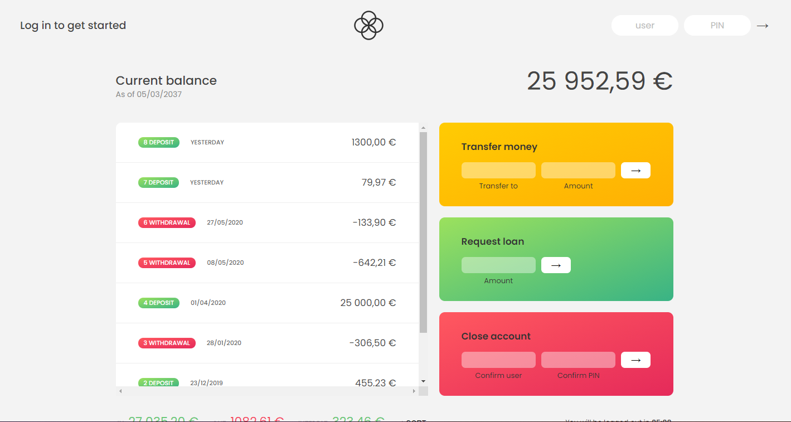

# BANKIST APP 

Bankist app created by Maurizio Strazzullo for study purposes using simple **HTML CSS Vanilla JS**.

View static site result here: [Bankist App on Vercel](https://bankist-app-zeta.vercel.app/)

This app was created for educational purposes only for the study and deepening of **Vanilla Javascript**, it has not been made responsive and **does not use** any Css Framework (Bootstrap, Tailwind, Material, etc. ..). The application is constantly updated and evolved, and I leave the template available to anyone who needs a solid foundation for an app / WebApp.

***
Here is a small explanatory flowchart of the application:

Anyone who wants to help me improve the project is obviously welcome!! :wink:
